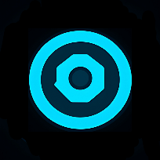

<!DOCTYPE html>
<html lang="en">
<head>
    <meta charset="UTF-8">
    <meta name="viewport" content="width=device-width, initial-scale=1.0">
    <title>Cyanix AI</title>
    
    <!-- PWA Configuration -->
    <link rel="manifest" href="/CyanixAi/manifest.json">
    <meta name="theme-color" content="#0d0221">
    <meta name="apple-mobile-web-app-capable" content="yes">
    <meta name="apple-mobile-web-app-status-bar-style" content="black-translucent">
    <link rel="apple-touch-icon" href="/CyanixAi/icons/icon-192x192.png">
    
    
</head>
<body>
    <!-- Milky Way Galaxy Background -->
    

        

        

        

        

        

        

        

        

        

        

    

    
    <!-- Scan line effect -->
    

    <!-- Install Prompt Popup -->
    

        

            
📲

            
Install Cyanix AI

            <button class="install-popup-close" onclick="hideInstallPopup()">×</button>
        

        

            Install Cyanix AI on your home screen for quick access and offline use. 
            Works just like a native app!
        

        

            <button class="install-popup-btn secondary" onclick="hideInstallPopup()">Later</button>
            <button class="install-popup-btn primary" onclick="installPWA()">Install Now</button>
        

    

    <!-- Login Screen -->
    

        

            

                
            

            <h1 class="login-title">Cyanix AI</h1>
            
Your intelligent assistant

            
            

                <input type="password" id="apiKeyLoginInput" class="text-input" placeholder="Enter your Groq API Key" autocomplete="off" />
                <small>
                    Get free key at <a href="https://console.groq.com" target="_blank">console.groq.com</a>
                </small>
                <small style="display: block; margin-top: 8px; color: var(--cyan-neon); font-weight: 600;">
                    ⚠️ Your API key is your password - stored locally and never shared
                </small>
            

            
            <button class="primary-btn" onclick="login()">Enter Cyanix AI</button>
            
            

                🔐 Fully private - no data saved, no tracking, no accounts
            

        

    

    <!-- Chat Screen -->
    

        

            <button class="menu-btn" onclick="toggleMenu()">☰</button>
            
Cyanix AI

            

        

        <!-- Quick Actions Toolbar -->
        

            <button class="quick-action-btn" onclick="sendQuickMessage('Explain this concept simply')">💡 Explain</button>
            <button class="quick-action-btn" onclick="sendQuickMessage('Help me brainstorm ideas')">🧠 Brainstorm</button>
            <button class="quick-action-btn" onclick="sendQuickMessage('Write code for')">💻 Code</button>
            <button class="quick-action-btn" onclick="sendQuickMessage('Analyze this')">📊 Analyze</button>
            <button class="quick-action-btn" onclick="sendQuickMessage('Summarize')">📝 Summarize</button>
            <button class="quick-action-btn" onclick="sendQuickMessage('Tell me a joke')">😄 Joke</button>
        

        

        

            

                <textarea 
                    id="messageInput" 
                    class="message-input" 
                    placeholder="Message" 
                    rows="1"
                    oninput="autoResizeInput(this)"
                    onkeydown="handleKeyDown(event)"
                ></textarea>
            

            <button class="send-btn" onclick="sendMessage()">↑</button>
        

    

    <!-- Side Menu -->
    

    

        

            
C

            

                <h3>Cyanix User</h3>
                
Anonymous Session

            

        

        

            
AI Mode

            <button class="menu-btn-item" onclick="setAIMode('nix')">⚡ Nix - Quick Responses</button>
            <button class="menu-btn-item" onclick="setAIMode('default')">🤖 Cyanix - Balanced</button>
            <button class="menu-btn-item" onclick="setAIMode('nova')">🧠 Nova - Deep Thinking</button>
        

        

            
Settings

            

                Auto-Speak
                <label class="switch">
                    <input type="checkbox" id="autoSpeakToggle" checked onchange="toggleAutoSpeak()">
                    
                </label>
            

            

                Voice Speed
                <input type="range" class="range-slider" min="50" max="150" value="90" id="voiceSpeedSlider">
            

        

        

            
API Keys

            <button class="menu-btn-item" onclick="showAPIKeyDialog()">🔑 Configure API Keys</button>
        

        

            
App Installation

            
Checking installation status...

            <button class="menu-btn-item install-btn" onclick="installPWA()" id="installBtn" style="display: none;">
                📲 Install Cyanix AI
            </button>
            <button class="menu-btn-item" onclick="showInstallInstructions()">📋 Installation Guide</button>
        

        

            <button class="menu-btn-item danger" onclick="logout()">🚪 Logout</button>
        

    

    <!-- API Key Configuration Dialog -->
    

        

            <h2>Configure API Keys</h2>
            
Enter your API keys to enable AI responses. Keys are stored locally in your browser.

            
            

                <label>
                    Groq API Key 
                    Not Configured
                </label>
                <input type="password" id="groqKeyInput" placeholder="gsk_..." autocomplete="off" />
                <small>Get free key at <a href="https://console.groq.com" target="_blank">console.groq.com</a></small>
                <small style="display: block; margin-top: 4px; color: #ff006e; font-weight: 600;">
                    ⚠️ Make sure to copy the FULL key (starts with gsk_)
                </small>
            

            

                <label>
                    Anthropic API Key (Optional)
                    Not Configured
                </label>
                <input type="password" id="anthropicKeyInput" placeholder="sk-ant-..." autocomplete="off" />
                <small>Get key at <a href="https://console.anthropic.com" target="_blank">console.anthropic.com</a></small>
            

            

                <button class="btn-cancel" onclick="closeAPIKeyDialog()">Cancel</button>
                <button class="btn-save" onclick="saveAPIKeys()">Save Keys</button>
            

        

    

    
</body>
</html>